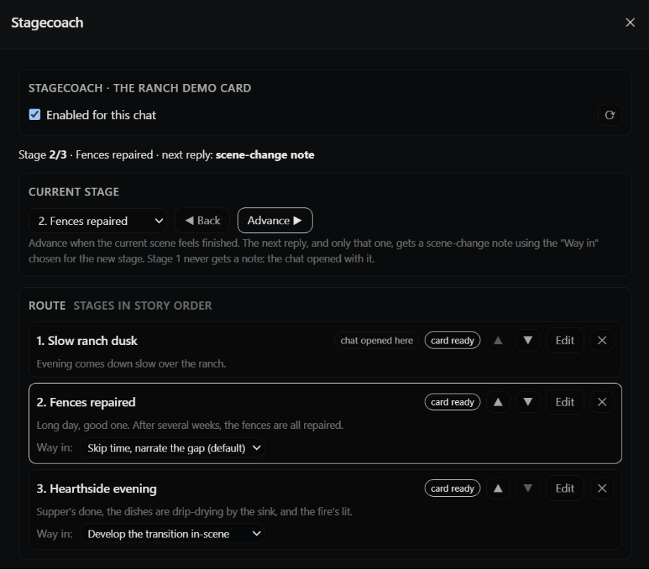

# Stagecoach

A [Lumiverse](https://lumiverse.chat) Spindle extension that treats a character card's greetings (`first_mes` plus `alternate_greetings`) as an **ordered sequence of story stages** and soft-steers a roleplay through them.

Mechanically it is an Author's Note with a moving pointer: a single scene-change note, injected once when you advance, describing only the new stage. The value of the extension is what it *withholds*. A static scenario field shows the model the entire arc on every turn, so the arc is either ignored (it sits far from the generation point) or speedrun (everything in context reads as relevant now). This extension shows the model only the current stage, and reveals the next one in controlled steps.

Stagecoach is an independent, unofficial community extension and is not affiliated with Lumiverse.

## Why

Plenty of cards write their alternate greetings as sequels ("two weeks later…") rather than alternatives. Picking one means a fresh chat with none of the history. Stagecoach lets you play them in any order, in one chat.



## Features
 
- A drawer tab with a per-chat enable toggle.
- A route builder: pick which greetings count as stages, and in what order.
- A stage-card editor (label, scene, mood) with a token count, a live preview of the injected text, and a **Distill** button that drafts the fields with one LLM call (model selectable).
- The standing instructions after scene and mood ("Keep the story inside this scene…") are editable from the preview, with a reset to the original wording, so you can tune them for your model.
- A current-stage selector with **Advance** and **Back**.
- Two injection modes: appended to the last user message wrapped as `(OOC: …)` (default; steered reliably in testing), or a system message at a chosen depth from the end of history (visible as its own Prompt Breakdown block, but some models ignore it).
- One note per stage: the first reply after you press Advance gets a scene-change note, and nothing else is injected. Stage 1 never gets a note, since the chat opened with that greeting.
- A per-stage **Way in** choice that shapes the arrival wording: skip time and narrate the gap (default), hard cut, or develop the transition in-scene. Models differ in how they bridge scenes; pick per transition.

## Install

1. Open Lumiverse → Extensions → install from GitHub URL and paste this repository's URL. The checked-in `dist/` build is what runs.
2. Grant the `characters`, `chats`, `generation` and `interceptor` permissions.
3. Open a chat, then open the **Stages** drawer tab.

## Using it

1. **Enable** the extension for the chat.
2. **Add greetings to the route** in story order. Cards that write alternate greetings as "later chapters" work well; parallel alternate greetings may have a janky transition without extra prompt customization.
3. **Edit each stage** and press **Distill** (or fill the fields in by hand), then **Save**. Aim for about 50 tokens per card, hard cap 90. Keep `{{char}}` and `{{user}}` literal; names are substituted at injection time.
4. For each stage after the first, pick a **Way in** in the route list. It shapes the one note sent when you advance into that stage.
5. Play. When a scene feels finished, press **Advance**. The next reply opens the new stage the way you chose.

Check the result in Prompt Breakdown (Extras -> Dry Run): in append mode the directive appears at the end of your latest user message; in system mode it is its own block. Either way it contains only the current stage's scene and mood.

## Notes

- **Never writes to character cards.** Cards stay portable. All state lives in this extension's per-user storage: `cards/<hash>.json` (stage cards, content-addressed by the greeting text) and `chats/<chatId>.json` (the route for one playthrough).
- **The interceptor is pure.** It reads cached state, splices one message, and returns. No LLM calls, no storage writes, no state changes. Dry runs and prompt previews run it safely.
- **Later stages never reach the prompt.** The rendering code only receives the current stage card.
- Impersonate and quiet generations are passed through untouched.
- **Group chats are not yet supported** - recommend to **DISABLE Stagecoach for group chats**, as currently it's unintentionally injecting when it shouldn't be. This displeases me and will be addressed.

## Development

```sh
bun install
bun run verify     # typecheck + tests + build
```

Source lives in `src/`:

- `core/` pure modules (hashing, tier selection, templates, injection, route transitions) with tests.
- `backend.ts` the Bun worker: storage, the interceptor, Distill, frontend messaging.
- `frontend.ts` the drawer tab.
- `shared/types.ts` data model and the frontend/backend message protocol.

Commit `dist/` after building; Lumiverse runs the checked-in bundle.

## How this was made / Future Updates

Vibecoded. A human did the wanting, the design decisions, and the testing; Claude wrote the code. It was built to scratch one specific itch, and it scratches it. There are some parked ideas for future updates that may or may not ever see a line of code.
 
## Maintenance

Best-effort, no promised turnaround. Open an issue and I'll look when I can. If you want to fork it, fold it into something bigger, or take it over outright, go for it: it's MIT, and if you tell me, I'll link your fork from here or transfer the repo.

## Feature requests

Open an issue. Requests may be considered based on ease of implementation and my current sanity levels.

## License

MIT. See [LICENSE](LICENSE).
